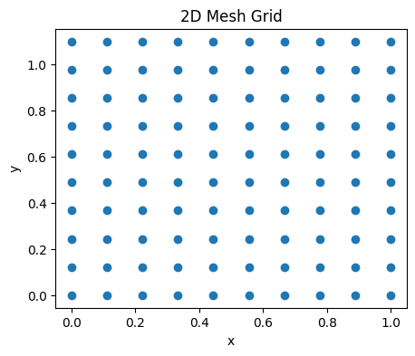
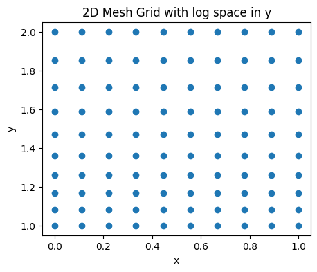

# Basic Examples of einmesh

This notebook demonstrates the core functionality of einmesh through simple examples. We'll explore:

1. Creating basic 2D meshgrids using linear spaces
2. Working with 3D grids using different space types (LogSpace and UniformDistribution)
3. Using repeated dimensions in patterns

einmesh provides an intuitive, einops-style syntax for creating multi-dimensional meshgrids, making it easy to define complex coordinate systems with just a few lines of code.


```python
import matplotlib.pyplot as plt

from einmesh import (
    LinSpace,  # Spaces to create the meshgrid
    LogSpace,
    UniformDistribution,
    einmesh,  # The main function to create the meshgrid
)
```

The first thing to know is the use of einstein notation to create the shapes of the meshgrid that is being generated by einmesh. An einmesh pattern consists of space separated names ("x y z"), parenthesis("(x y) z") and stars ("* x y z").

Each name has to have a corresponding key word argument (kwarg) which should consist of an einmesh space class. In the below example we showcase this by creating a 2D square mesh between 0 and 1, with 10 points in each dimension.


```python
x_coords, y_coords = einmesh("x y",
                             x=LinSpace(start=0, end=1, num=10),
                             y=LinSpace(start=0, end=1.1, num=10))
print(x_coords.shape, y_coords.shape)

plt.figure(figsize=(5, 4))
plt.scatter(x_coords, y_coords)
plt.xlabel("x")
plt.ylabel("y")
plt.title("2D Mesh Grid")
plt.show()
```

    torch.Size([10, 10]) torch.Size([10, 10])





By changeing the space type, we change the type of sampling


```python
x_coords, y_coords = einmesh("x y",
                             x=LinSpace(start=0, end=1, num=10),
                             y=LogSpace(start=0, end=1, num=10, base=2))
print(x_coords.shape, y_coords.shape)
plt.figure(figsize=(5, 4))
plt.scatter(x_coords, y_coords)
plt.xlabel("x")
plt.ylabel("y")
plt.title("2D Mesh Grid with log space in y")
plt.show()

```

    torch.Size([10, 10]) torch.Size([10, 10])





If one wants to have two dimension that are identically sampled, one can simply repeat an axis in the pattern.


```python
x_coords_repeated, y_coords_repeated = einmesh("x x", x=LinSpace(start=0, end=1, num=10))
print(x_coords_repeated.shape, y_coords_repeated.shape)
```

    torch.Size([10, 10]) torch.Size([10, 10])


If you want the meshgrid to return a stacked tensor, you can use the * operator. The meshgrid will be stacked in the dimensions in which the * is located in the pattern.


```python
coords_stacked_start = einmesh("* x x", x=LinSpace(start=0, end=1, num=10))
print(f"{coords_stacked_start.shape=}")
coords_stacked_mid = einmesh("x * x", x=LinSpace(start=0, end=1, num=10))
print(f"{coords_stacked_mid.shape=}")
coords_stacked_end = einmesh("x x *", x=LinSpace(start=0, end=1, num=10))
print(f"{coords_stacked_end.shape=}")
```

    coords_stacked_start.shape=torch.Size([2, 10, 10])
    coords_stacked_mid.shape=torch.Size([10, 2, 10])
    coords_stacked_end.shape=torch.Size([10, 10, 2])


In style with einops.rearrange, axis can be combined (flattened), by using a parenthesis.


```python
coords_flattened = einmesh("* (x y)", x=LinSpace(0, 1, num=10), y=LinSpace(0, 1, num=10))
print(f"{coords_flattened.shape=}")
everything_flattened = einmesh("(* x y)", x=LinSpace(0, 1, num=10), y=LinSpace(0, 1, num=10))
print(f"{everything_flattened.shape=}")
```

    coords_flattened.shape=torch.Size([2, 100])
    everything_flattened.shape=torch.Size([200])


The grids that are generated by einmesh be of arbitrary dimensionality, and arbitrary combination of spaces. So if you want to generate a 9D grid, it is as easy as changing the pattern.


```python

nine_d_grid = einmesh("* x y z w v u t s r",
                  x=LinSpace(start=0, end=1, num=1),
                  y=LinSpace(start=0, end=1, num=2),
                  z=LogSpace(start=0, end=1, num=3),
                  w=LinSpace(start=0, end=1, num=4),
                  v=LogSpace(start=0, end=1, num=5),
                  u=LinSpace(start=0, end=1, num=6),
                  t=LinSpace(start=0, end=1, num=7),
                  s=UniformDistribution(low=0, high=1, num=8),
                  r=LinSpace(start=0, end=1, num=9),
                  )
print(f"{nine_d_grid.shape=}")
```

    nine_d_grid.shape=torch.Size([9, 1, 2, 3, 4, 5, 6, 7, 8, 9])


And you can arbitrarily combine axis as you want


```python
nine_d_grid = einmesh(
    "x (y z w) v (u t) (* s) r",
    x=LinSpace(start=0, end=1, num=1),
    y=LinSpace(start=0, end=1, num=2),
    z=LogSpace(start=0, end=1, num=3),
    w=LinSpace(start=0, end=1, num=4),
    v=LogSpace(start=0, end=1, num=5),
    u=LinSpace(start=0, end=1, num=6),
    t=LinSpace(start=0, end=1, num=7),
    s=UniformDistribution(low=0, high=1, num=8),
    r=LinSpace(start=0, end=1, num=9),
)
print("Shape should be (x, y*z*w, v, u*t, stacked_dim*s, r)")
print(f"i.e Shape should be {1, 2*3*4, 5, 6*7, 9*8, 9}")
print(f"{nine_d_grid.shape=}")

```

    Shape should be (x, y*z*w, v, u*t, stacked_dim*s, r)
    i.e Shape should be (1, 24, 5, 42, 72, 9)
    nine_d_grid.shape=torch.Size([1, 24, 5, 42, 72, 9])
